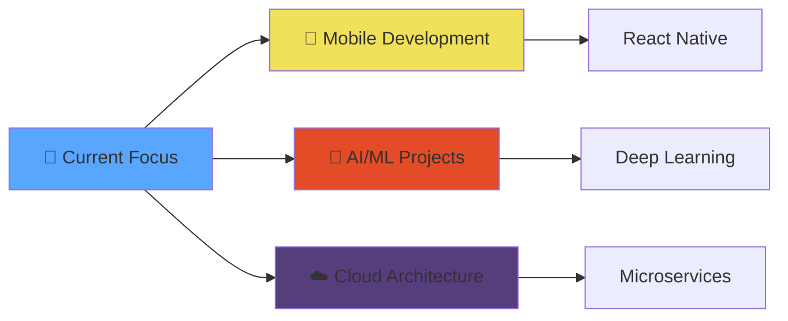

# 👋 Hi there, I'm Nabil!

<div align="center">
  
  <!-- Animated Typing Effect -->
  [](https://git.io/typing-svg)
  
  <br/>
  
  <!-- Profile Views with Custom Styling -->
  
  
  <!-- Social Badges -->
  [](https://linkedin.com/in/nabilthange)
  [](https://twitter.com/nabilthange)
  [](https://nabil-t.vercel.app/)
  [](mailto:thangenbail@gmail.com)

</div>

---

## 🚀 About Me

```javascript
const nabil = {
    location: "India 🇮🇳",
    currentFocus: "Full Stack Development",
    learning: ["Next.js", "SQL", "Machine Learning", "Data Science"],
    background: "Commerce Student turned Developer 📈➡️💻",
    passion: "Building innovative solutions that make a difference",
    motto: "Code with purpose, learn with curiosity! ✨"
};
```

---

## 🔥 Featured Projects

<div align="center">

### 🍎 [NutriSnap AI](https://nutrisnapp-ai.vercel.app)
> **Smart Nutrition Tracking with AI** 🤖  
> Advanced food recognition and nutritional analysis platform

[](https://nutrisnapp-ai.vercel.app)

### 🤖 [NbAIl Assistant](https://nbail-v4.vercel.app/)
> **Personal AI Assistant Platform** 🧠  
> Intelligent conversational AI with advanced capabilities

[](https://nbail-v4.vercel.app/)

### 🎵 [Musty - AI Study Companion](https://musty-mu.vercel.app/)
> **Next-Gen Study Experience** 🎶  
> Modern Study platform with AI features

[](https://musty-mu.vercel.app/)

</div>

---

## 🛠️ Tech Arsenal

<div align="center">

### 🎨 Frontend Technologies


### ⚙️ Backend & Database


### 🤖 AI/ML & Data Science


### 🎨 Design & Creative Tools


### ☁️ Cloud & DevOps


### 🔧 Other Tools


</div>

---

## 📊 GitHub Analytics

<div align="center">
  
  <!-- GitHub Stats Cards with Animations -->
  
  
  
  <br/><br/>
  
  <!-- Language Stats -->
  
  
  <br/><br/>
  
  <!-- Activity Graph -->
  
  
  <br/>
  
  <!-- Trophy Display -->
  

</div>

---

## 🎯 Current Goals

<div align="center">


```mermaid
graph LR
    A[🎯 Current Focus] --> B[📱 Mobile Development]
    A --> C[🤖 AI/ML Projects]
    A --> D[☁️ Cloud Architecture]
    B --> E[React Native]
    C --> F[Deep Learning]
    D --> G[Microservices]
    
    style A fill:#58a6ff
    style B fill:#f1e05a
    style C fill:#e34c26
    style D fill:#563d7c
```

</div>

- 🚀 **Expanding AI capabilities** in my applications
- 📱 **Learning mobile development** with React Native
- ☁️ **Mastering cloud architecture** and DevOps practices
- 🌐 **Contributing to open source** projects
- 📈 **Building scalable solutions** for real-world problems

---

## 🌟 Fun Facts

<div align="center">

| 💼 Background | 🎯 Passion | 🌱 Learning | ⚡ Superpower |
|:---:|:---:|:---:|:---:|
| Commerce → Tech | Building with Purpose | Never Stops | Problem Solving |

</div>

- 📚 **From Commerce to Code**: Made the exciting transition from business studies to software development
- 🎨 **Design Meets Development**: Love creating beautiful, functional user experiences
- 🤖 **AI Enthusiast**: Fascinated by the potential of artificial intelligence
- 🌍 **Global Mindset**: Building solutions that can impact users worldwide

---

## 📫 Let's Connect!

<div align="center">

**💬 Open to discussions about:**
- 🚀 Web Development & React Ecosystem
- 🤖 AI/ML Applications
- 💡 Startup Ideas & Innovation
- 🎨 UI/UX Design Principles

<br/>

**📧 Reach out to me:**

[](https://linkedin.com/in/nabilthange)
[](mailto:thangenbail@gmail.com)
[](https://nabil-t.vercel.app/)

</div>

---

<div align="center">
  
  ### 🚀 "Code is poetry, and every bug is just a plot twist!" 
  
  
  
  
  
</div>
